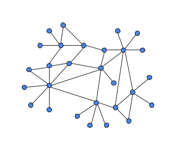
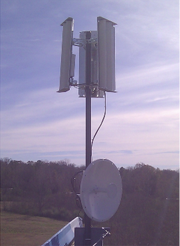
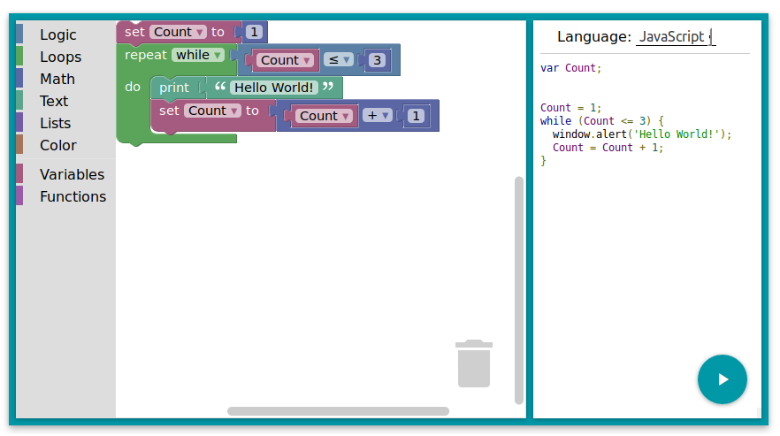

# Notes 
<!---->

##Collaboration tech [chat, VOIP, forums] 

- **Riot and Matrix**. For daily communications among collaborators, we've been using [Riot.im](http://riot.im), which is a slick client (on smartphones, in browsers, and with desktop clients) for the [Matrix](http://matrix.org) protocol.  Matrix is intended to be a decentralized chat and VOIP protocol -- decentralized in the sense that Matrix server software is open source, can be run independently (even on a single-board computer like a Raspberry Pi), and can be federated.  It is also intended to be a 'bridging' protocol:  multiple other messaging protocols are currently supported (e.g. Slack, IRC) and interfaced by a Matrix server. Conversations and threads are organized within 'rooms'; VOIP seems to be stable, even in relatively low-bandwidth networking conditions (comparing favorably with Skype and Google Hangouts); and there is the ability to manage 'integrations' such as attatching an Etherpad (collaborative document editing) to a 'room'.

- **Discourse**.

## Farm information management

- **FarmOS**.

## Wireless communications

- **Low-power, long-range radio**. For larger farms, or for off-grid monitoring applications, it may be convenient to use radio technologies that are lower-power than 'wifi'.  One relatively new technology in this category is '[LoRa](https://www.digikey.com/en/articles/techzone/2016/nov/lorawan-part-1-15-km-wireless-10-year-battery-life-iot)', a proprietary IOT radio protocol and associated hardware stack that enables longer ranges than wifi:  LoRa can achieve 1000s of meters, line of sight, while WiFi typically only offers 10's of meters.  The tradeoff is that LoRa is capable of far lower bandwidth than WiFi, isn't (easily) capable of meshing as wifi is, and doesn't 'speak' TCP/IP.  LoRa is appropriate for low-bandwidth communications (like a short text message, or a sensor reading), and can achieve very low power consumption in intermittent broadcast scenarios (periodic messages or sensor readings, separated by several minutes). We recently achieved an approximate 1 kilometer range between two LoRa radio modules, using simple prototyping-wire antennae, in an urban environment.

- **Wifi mesh**. The ability to 'mesh' wifi routers -- that is, to set up routers with overlapping effective range areas that allow for information to 'hop' across these routers over distances longer than any individual router's range -- is useful for 'higher-bandwidth' applications in a farm communications or sensing context:  VOIP, chat, video and image capture, and locally-centralized sensor datalogging servers.  We will be experimenting with routers and protocols designed to make mesh networking easier -- in particular, [Ubiquity](https://www.ubnt.com/products/#default) routers, used in the manner that groups like [NYCMesh](https://nycmesh.net) have deployed them. 

## Farm automation / robotics

- **Blockly and Scratch**.  [Blockly](https://developers.google.com/blockly/) and [Scratch](https://scratch.mit.edu/) are both graphical programming interfaces that enable automation and measurement processes to be designed using graphical, interactive 'code blocks' that provide standard declarative programming structures (declaring and manipulating variables, for loops, etc).  We are experimenting with using this style of interface to the design of custom, automated processes on the farm (controlling HVAC, pumps, sensors and actuators) easy to accomplish.

- **Grove Pi**.  The 'Grove' 

- **ROS**.

## Instrumentation / sensors.

- **Water level**.

- **Conductivity**.

- **Electric fence monitoring.**

## Power generation and storage

- **Solar**.

- **Wind**.

- **Water**.

<!--
**[Blockchain 001](blockchain1.html)**. Thoughts on how and whether the blockchain enhances autonomy and solidarity.  

#**[Blockchain 002](blockchain1.html)**. How to use the blockchain in particular applications. 
-->
